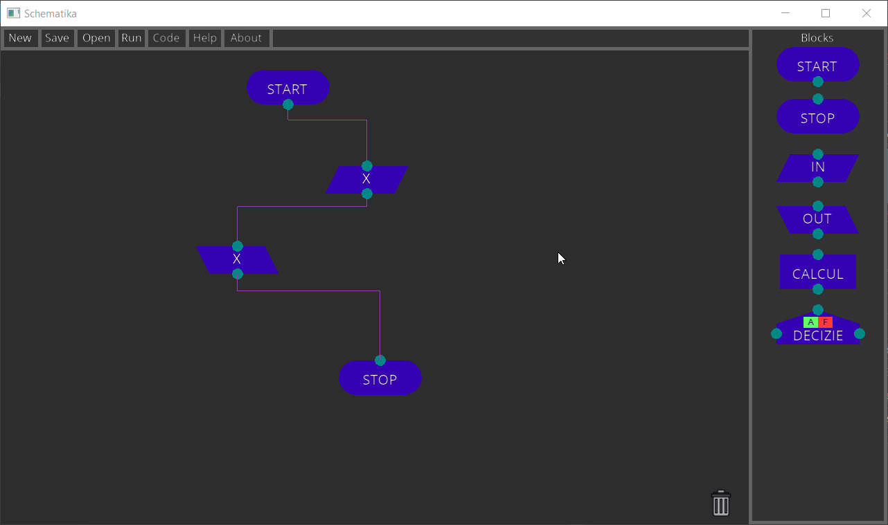

# Schematika

# Description
Schematika is a graphical code editor, using simple blocks to represent the flow of a program, that can generate c code for a given input flowchart.

# Features
- Generating c code from flowcharts
- Saving/Loading of flowcharts
- Running of flowcharts in an interpreted manner